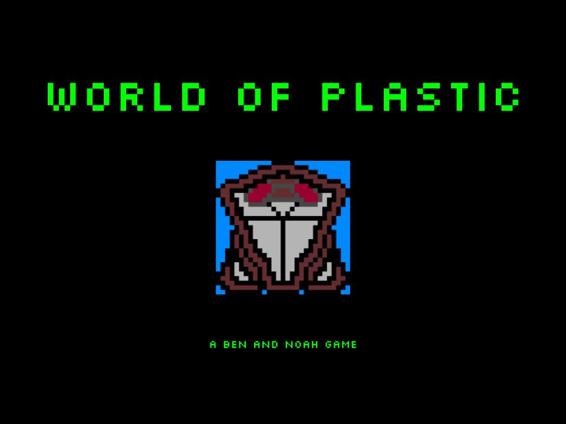

# Hack For The World 2026
Theme: sustainability\
Game: World of Plastic\
Built with: HTML5, JavaScript, CSS\
Cover:\

# About
## Inspiration
The world is always gonna have bad people and plastic polluting the ocean, it's never gone end, so we're always gonna lose. But, we can still fight for as long as possible.

## What it does
A web game where the goal is to collect trash.

## How we built it
Built in HTML + JavaScript + CSS.

## Challenges we ran into
Math. Vector math / position math / collision math.

## Accomplishments that we're proud of
It works. We were able to figure out the math and get past the complications.

## What we learned
Math.

## What's next for World of Plastic
Updating. Making the game less laggy and better.